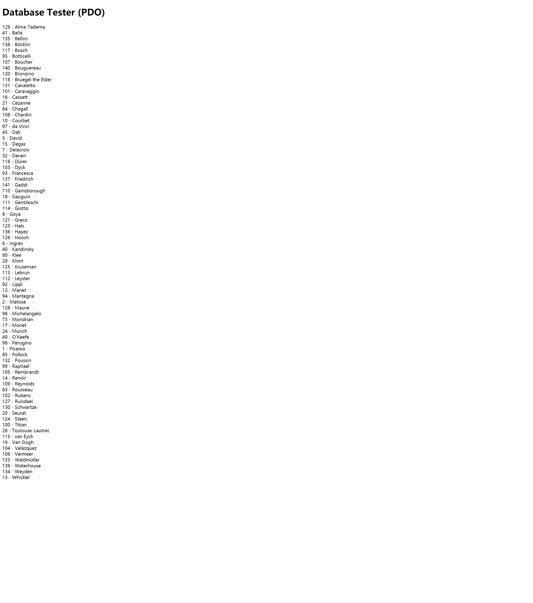
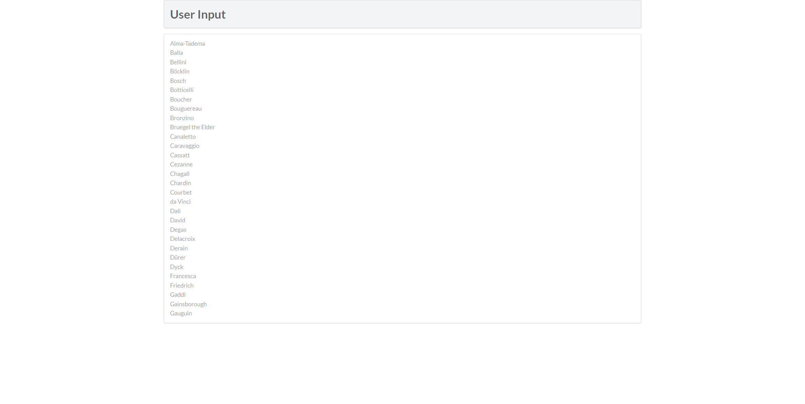

EX7:
PDO:

解释：
首先通过require定义的几个变量建立与数据库的连接，通过setAttribute方法来使语句执行出错时抛出异常，而后定义查询语句，获得查询结果，并将结果列出来，而后关闭连接。如有异常，则执行catch语句块。
MYSQLI：

解释：
首先通过require定义的几个变量建立与数据库的连接，然后判断连接是否出错，如正常，则定义查询语句，执行查询，并将查询结果的每一行转化为数组，通过数组获得各个属性值，显示在浏览器上，最后释放结果内存，关闭连接。
EX8：

outputArtists解释：
通过pdo方式与数据库建立连接，查询所有列并通过lastname排序，限制在30行以内，而后通过判断将结果通过超链接展现出来
outputPaintings：
先判断是否传入id，传入且大于0则于数据库建立连接，而后从paintings数据库查询artistid=id的结果，并将结果转化为数组，传入outputSinglePainting，最后关闭连接
outputSinglePainting：
接受来自outputPaintings的数组参数，并将其中的值以HTML的格式展现在浏览器中。
EX9：

方法：1.exec()方法，返回执行语句后受影响的行数
2.query()方法 返回执行后的结果集
3.预处理语句：prepare()语句和execute()语句，prepare做准备工作，execute执行查询。
好处：对于预查询语句，可以在其中绑定参数，可以通过改变绑定参数的值，重新执行查询，而不需要修改查询语句，对于不同数据执行大量相同查询时，更为方便。