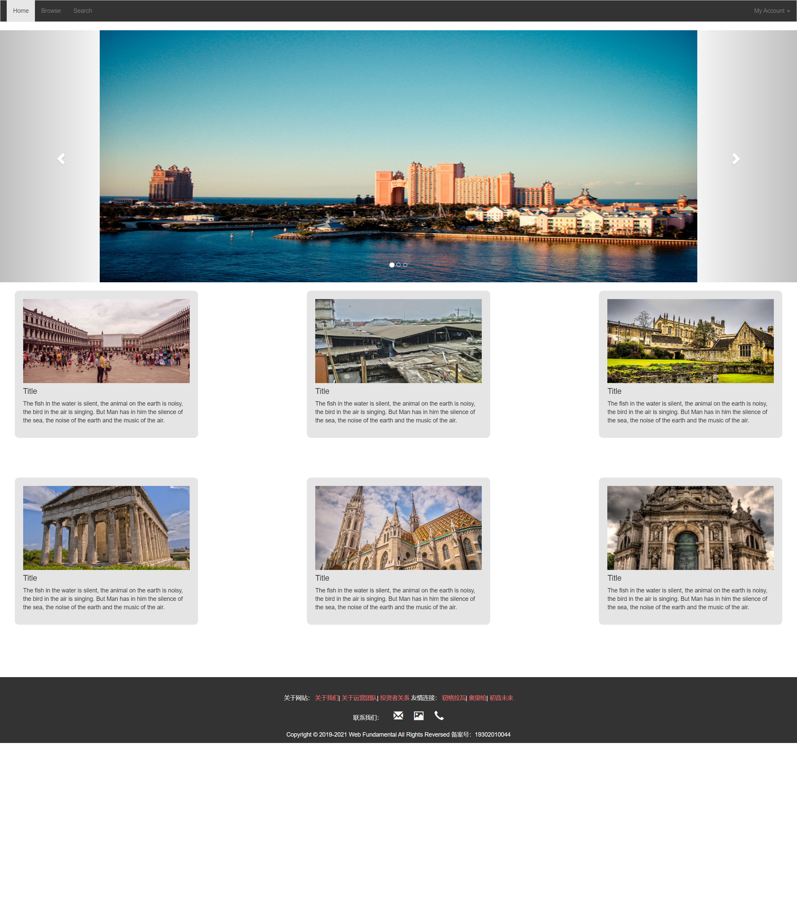

首先是主页的截图
  

index界面可以分为4个部分 ，分别为nav 轮播图 图片展示 页脚。总体布局为自上而下一般布局。

nav： 运用了bootstrap插件 ，并对背景颜色等细节做了修改，使其完善

轮播图：运用了bootstrap的js插件 ，并对图片做了宽度和高度上的规定。

图片展示：轮播图下面展示了6张图片 每张图片下面都有相应的标题与简介。这一板块运用了flex布局，设置flex-wrap：wrap；justify-content: space-around; 同时对每一个小的板块规定了宽度，设置了内边距，背景色，margin和border-radius。为图片设定了宽度和高度，图片的object-fit：cover；图片的描述部分运用了多行文本省略。

页脚：页脚部分同图片展示部分一样为自己设计的，有“关于网站”“友情连接”“联系我们”“Copyright”，为一般的布局。联系我们部分运用了bootstrap上的字体图标，并设置了大小。前三者中的连接鼠标移动到上面会高亮。