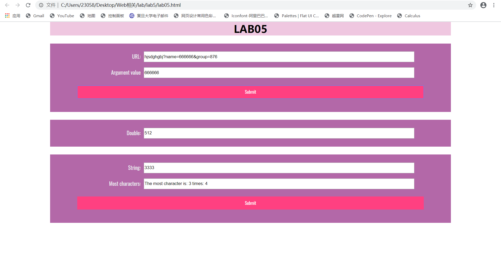

网页截图： 
github截图：

lab5说明：
 对于第一个函数：先获得输入的字符串，在字符串中查找“name=”，并查找自“name=”之后的第一个“&”，截取中间值即可。

 对于第二个函数：首先定义了setInterval和用于计数的变量count，判断count大小和getseconds是否为0决定是否终止，否则将value改为相应的值并对count累加。

 对于第三个函数：首先获得输入值，并定义了两个数组，array1用于记录不同的字符，array2用于记录对应字符出现的时间，然后对值中的每一个字符进行遍历，得到所有不同的字符和出现次数。
 然后再对array2数组遍历找出最大值即可。